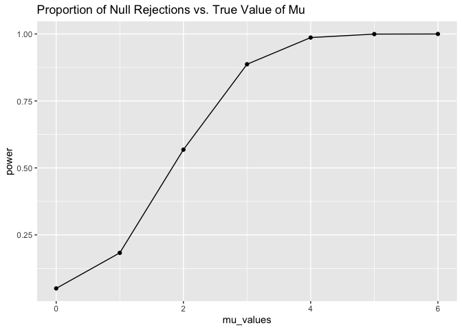
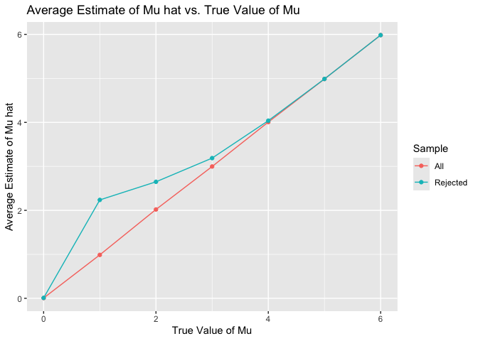

p8105_hw5_ek3376
================
ek3376
2024-11-15

``` r
library(tidyverse)
```

    ## ── Attaching core tidyverse packages ──────────────────────── tidyverse 2.0.0 ──
    ## ✔ dplyr     1.1.4     ✔ readr     2.1.5
    ## ✔ forcats   1.0.0     ✔ stringr   1.5.1
    ## ✔ ggplot2   3.5.1     ✔ tibble    3.2.1
    ## ✔ lubridate 1.9.3     ✔ tidyr     1.3.1
    ## ✔ purrr     1.0.2     
    ## ── Conflicts ────────────────────────────────────────── tidyverse_conflicts() ──
    ## ✖ dplyr::filter() masks stats::filter()
    ## ✖ dplyr::lag()    masks stats::lag()
    ## ℹ Use the conflicted package (<http://conflicted.r-lib.org/>) to force all conflicts to become errors

``` r
library(ggplot2)
library(dplyr)
library(tidyr)
library(rvest)
```

    ## 
    ## Attaching package: 'rvest'
    ## 
    ## The following object is masked from 'package:readr':
    ## 
    ##     guess_encoding

``` r
library(broom)
```

## Problem 1

``` r
set.seed(1)

birthday_duplicates = function(birthday) {
  birthdays <- sample(1:365, x, replace = TRUE)
  if (length(unique(birthdays)) < length(birthdays)) {
    return(TRUE)
  }
    else {
    return(FALSE)  
  }
}
```

## Problem 2

Below we define a simulation function for exploring the power of a
one-sample t-test. We observe the associated power of mu values 0
through 6.

``` r
set.seed(12)

n <- 30
sigma <- 5
alpha <- 0.05
nsim <- 5000
mu_values = 0:6


power_sim <- function(n, mu, sigma) {
  mu_hat <- numeric(nsim)
  p_value <- numeric(nsim)
  for (i in 1:nsim) {
    data <- rnorm(n, mean = mu, sd = sigma)
    t_test_result <- t.test(data, mu = 0)
    tidy_result <- broom::tidy(t_test_result) 
    mu_hat[i] <- tidy_result$estimate
    p_value[i] <- tidy_result$p.value
  }
  results <- tibble(mu_hat = mu_hat, p_value = p_value)
  return(results)
}

power_results <- numeric(length(mu_values))
avg_mu_hat <- numeric(length(mu_values))
avg_mu_hat_reject <- numeric(length(mu_values))

for (i in 1:length(mu_values)) {
  mu <- mu_values[i]
  results <- power_sim(n = n, mu = mu, sigma = sigma)
  power_results[i] <- mean(results$p_value < alpha)
  avg_mu_hat[i] <- mean(results$mu_hat)
  avg_mu_hat_reject[i] <- mean(results$mu_hat[results$p_value < alpha])
}

results <- tibble(
  mu_values = mu_values, 
  power = power_results,
  avg_mu_hat = avg_mu_hat,
  avg_mu_hat_reject = avg_mu_hat_reject
)
```

Below we plot the results of the proportion of times null was rejected
versus the true value of mu. Based on the plot, the power of the test
increases as the true value of mu increases, with a plateau/level off at
mu values 5 and 6 as the power has reached 1.

``` r
ggplot(results, aes(x = mu_values, y = power)) + 
  geom_line() + geom_point() + labs(
    title = "Proportion of Null Rejections vs. True Value of Mu"
  ) 
```

<!-- -->

Below we plot the average estimate of mu hat versus the true value of
mu. Additionally, we make a second plot overlayed showing the average
estimate of mu hat only in samples for which the null was rejected
versus the true value of mu. Based on the plots, the sample average of
mu hat across all tests is equal to the true value of mu. On the other
hand, the sample average of mu hat across tests for which the null is
rejected is not equal to the true value of mu. The estimated mu hat is
larger than the true value of mu for mu greater than 0 and this
difference levels off for larger values of mu until mu = 6. This
difference is the result of bias since we are selecting samples where mu
hat was farther from 0 skewing the avergae of mu hat.

``` r
ggplot(results, aes(x = mu_values)) + 
  geom_line(aes(y = avg_mu_hat, color = "All")) + 
  geom_point(aes(y = avg_mu_hat, color = "All")) + 
  geom_line(aes(y = avg_mu_hat_reject, color = "Rejected")) + 
  geom_point(aes(y = avg_mu_hat_reject, color = "Rejected")) + 
  labs(
    title = "Average Estimate of Mu hat vs. True Value of Mu",
    x = "True Value of Mu",
    y = "Average Estimate of Mu hat",
    color = "Sample"
  )
```

<!-- -->

## Problem 3

Below we import the homicide dataset from the Washington Post. Based on
the raw data, this dataset describes homicides in 50 large U.S. cities.

``` r
homicide_wp <- read_csv("data/homicide-data.csv")
```

    ## Rows: 52179 Columns: 12
    ## ── Column specification ────────────────────────────────────────────────────────
    ## Delimiter: ","
    ## chr (9): uid, victim_last, victim_first, victim_race, victim_age, victim_sex...
    ## dbl (3): reported_date, lat, lon
    ## 
    ## ℹ Use `spec()` to retrieve the full column specification for this data.
    ## ℹ Specify the column types or set `show_col_types = FALSE` to quiet this message.

The raw dataset for homicide_wp has 5.2178^{4} total observations and 12
variables. The variables include

Below we create a city_state variable and summarize within cities to
obtain the total number of homicides and the number of unsolved homcides
(those for which the disposition is “Closed without arrest” or “Open/No
arrest”).

``` r
homicide2 <- homicide_wp |>
  mutate(city_state = paste(city, state, sep = ", "))

homicide2 |>
  group_by(city_state) |>
  summarise(
    total_homicides = n(),
    unsolved_homicides = sum(disposition %in% c("Closed without arrest", "Open/No arrest"), na.rm = TRUE)
  )
```

    ## # A tibble: 51 × 3
    ##    city_state      total_homicides unsolved_homicides
    ##    <chr>                     <int>              <int>
    ##  1 Albuquerque, NM             378                146
    ##  2 Atlanta, GA                 973                373
    ##  3 Baltimore, MD              2827               1825
    ##  4 Baton Rouge, LA             424                196
    ##  5 Birmingham, AL              800                347
    ##  6 Boston, MA                  614                310
    ##  7 Buffalo, NY                 521                319
    ##  8 Charlotte, NC               687                206
    ##  9 Chicago, IL                5535               4073
    ## 10 Cincinnati, OH              694                309
    ## # ℹ 41 more rows

Below we use the prop.test function to estimate the proportion of
homicides that are unsolved, save the output as an R object, apply
broom::tidy to this object to obtain a tidy dataframe, and pull the
estimated proportion and confidence intervals from the resulting
dataframe.

``` r
baltimore_homicide <- homicide2 |>
  filter(city_state == "Baltimore, MD")

baltimore_summary <- baltimore_homicide |>
  summarise(
   total_homicide_baltimore = n(),
   unsolved_homicide_baltimore = sum(disposition %in% c("Closed without arrest", "Open/No arrest"), na.rm = TRUE)
  )

prop_test_output <- prop.test(
  x = baltimore_summary$unsolved_homicide_baltimore, 
  n = baltimore_summary$total_homicide_baltimore,
  conf.level = 0.95)

prop_test_output_tidy <- broom::tidy(prop_test_output)

estimated_proportion <- prop_test_output_tidy$estimate
conf_low <- prop_test_output_tidy$conf.low 
conf_high <- prop_test_output_tidy$conf.high 
```
